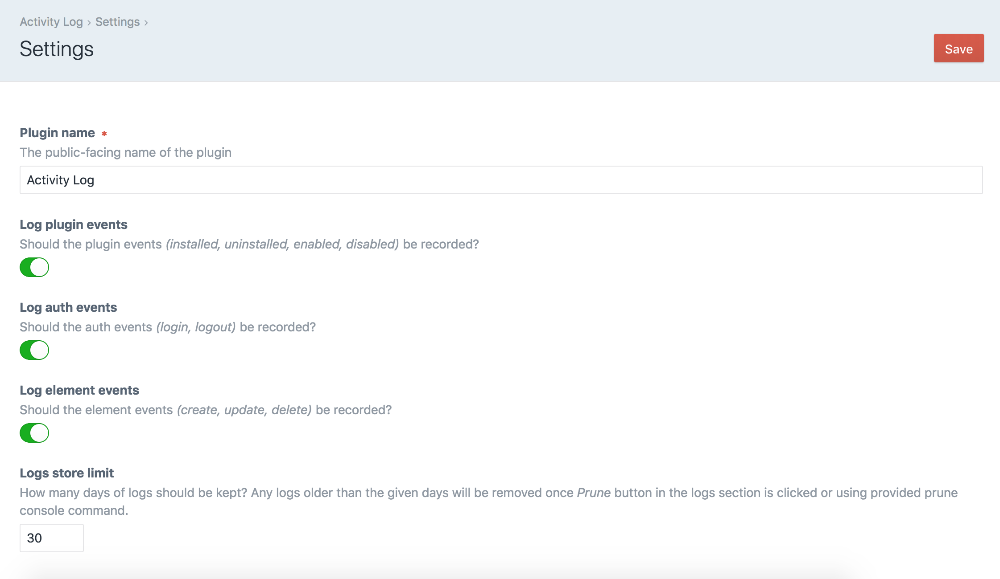
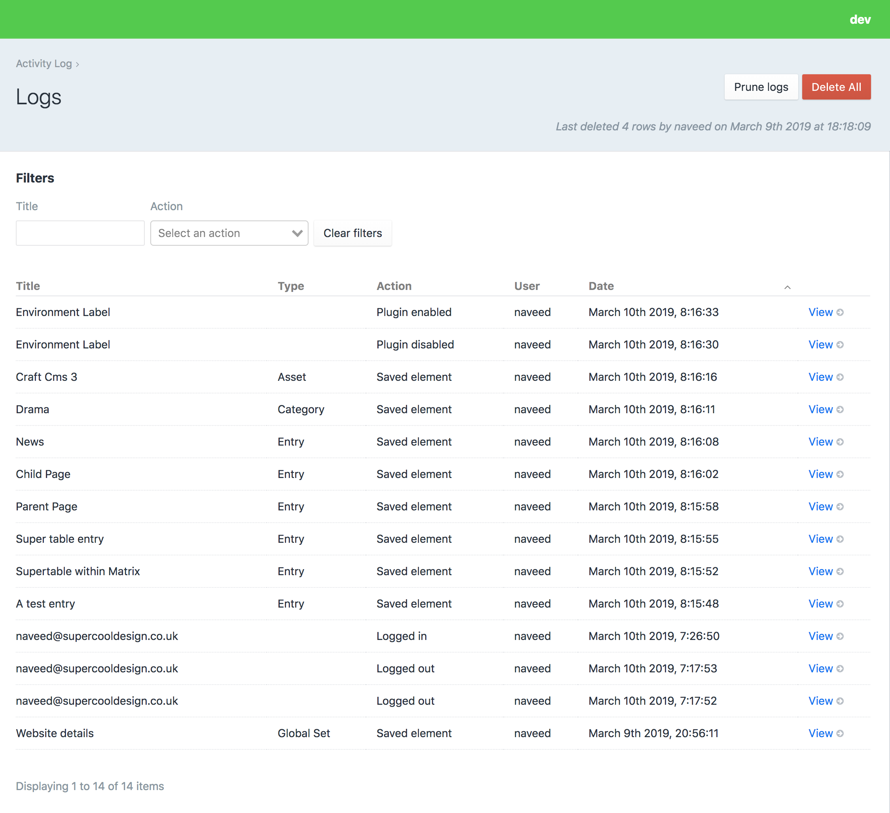
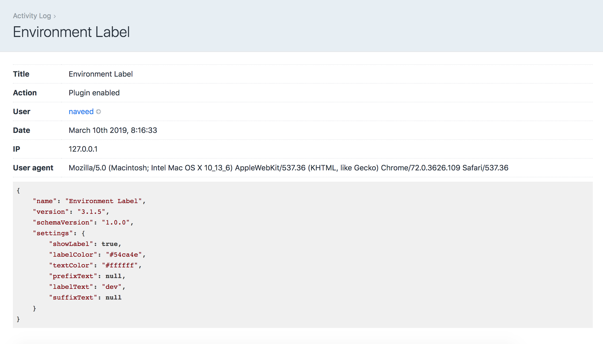
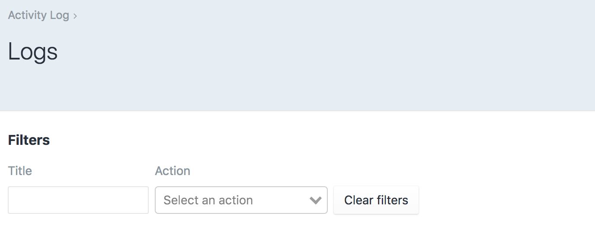
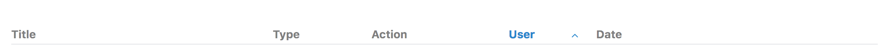
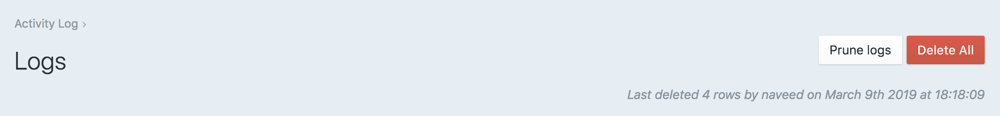
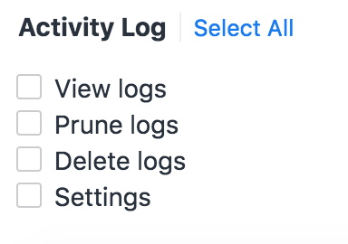

# Activity Log plugin for Craft CMS 3

Activity Log records user's activity in the control panel.

## Requirements

This plugin requires Craft CMS 3.0.0 or later.

## Installation

To install the plugin, follow these instructions.

1. Open your terminal and go to your Craft project:

```
cd /path/to/project
```

2. Then tell Composer to load the plugin:

```
composer require nav33d/craft-activitylog
```

3. In the Control Panel, go to Settings → Plugins and click the “Install” button for Activity Log.

## Overview
Activity Log will allow users to record some of the events in the Craft CMS control panel. It will record some of the following events:

- **Plugin events:** It will record when a plugin is installed, uninstalled, enabled or disabled.
- **Auth events:** It will record when a user logs in or logs out.
- **Element events:** It will record when an element is created, updated or deleted. Default elements in Craft are *Entries, Assets, Categories, Tags, Users and GlobalSet*. It will also record events for any custom elements.

## Settings
Settings allow user to configure Activity Log.



- **Plugin name:** The public-facing name of the plugin.
- **Log plugin event:** Should the plugin events (installed, uninstalled, enabled, disabled) be recorded?
- **Log auth events:** Should the auth events (login, logout) be recorded?
- **Log element events** Should the element events (create, update, delete) be recorded?
- **Logs store limit** How many days of logs should be kept? Any logs older than the given days will be removed once Prune button in the logs section is clicked or using provided prune console command.

## Logs
Once the plugin is installed and enabled it will start recording user's activity based on the settings. Once there are logs records you can view them in Logs section as well as filter and sort them.





### Filters

Following filters are provided:



- **Title:** You can filter the logs by title.
- **Action:** You can filter the logs by action *(Saved element, Created element, Deleted element and many more...)* 

### Sort
You can also sort logs by *Type, Action, User and Date* columns. To sort simply click on the relevant table heading.



### Prune logs
Its a button which appears on the top right hand corner of the Logs section if the user has permission to prune logs. 

You can decide how many days of logs to keep in the Settings section.

### Delete all logs
Its a button which appears on the top right hand corner of the Logs section if the user has permission to delete logs.



## Console commands

### **Prune**
You can also prune logs using the following prune command:

`./craft activitylog/logs/prune`

Logs will be pruned based on the Settings.

## Permissions
If you are using Craft CMS Pro edition then Activity Log provides permissions that can be used to grant / restrict access to users based on their User Group. These are set in **Settings->Users->User Groups**




- **View logs:** whether the user group has access to view the logs
- **Prune logs:** whether the user group has access to prune the logs based on settings
- **Delete logs:** whether the user group has access to delete all logs

- **Settings:** whether the user group has access to viewing and changing the plugin Settings

You should also grant them the Access Activity Log permission under General permissions.

## Credits

- Activity Log icon by [Noun Project](https://thenounproject.com/search/?q=activity&i=1288369)

Brought to you by [Naveed Ziarab](https://naveedziarab.co.uk)
